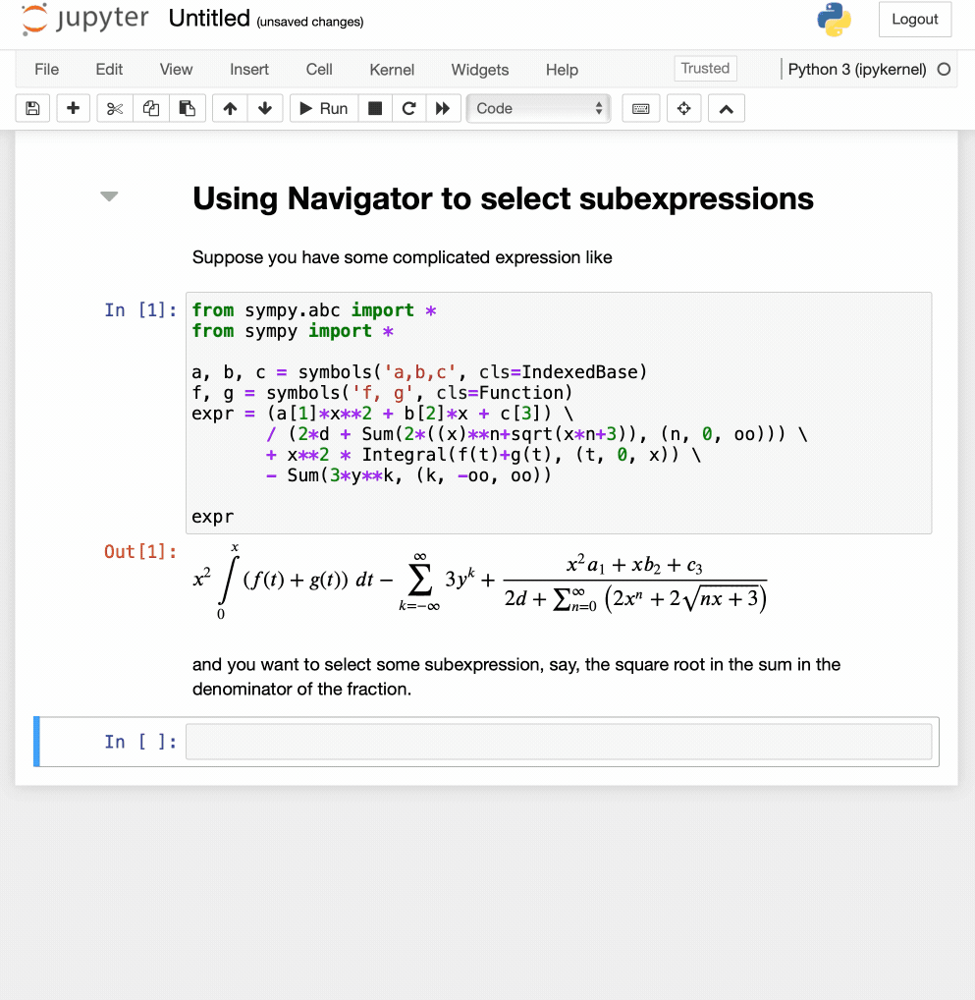

# sympytools

A Python package for more convenient calculations with SymPy.

## Installation

```
pip install --upgrade sympytools
```

## Usage

### Selecting subexpressions

To select a subexpression, use the `Navigator` class:




